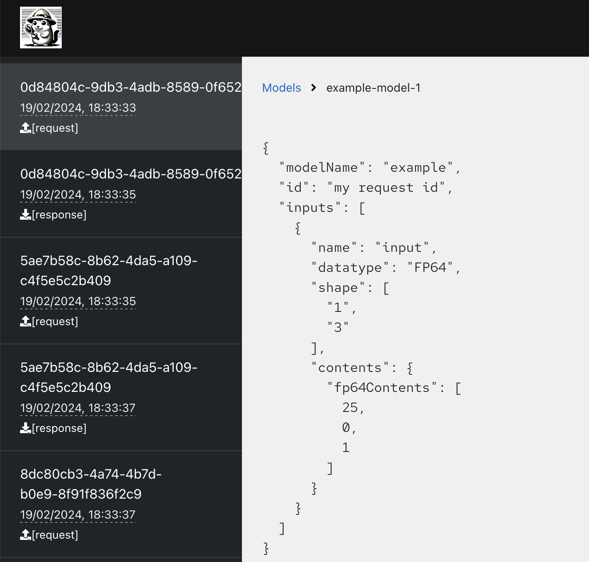

# modelserving-debugger


The `modelserving-debugger` is a ModelMesh Payload Monitor. A web application designed for monitoring payloads within the ModelMesh architecture, providing insights into both request and response payloads for all registered models. This application offers a convenient way to visualize and debug payload data. The application is deployed on Kubernetes/OpenShift environments and integrates seamlessly with ModelMesh by pointing the `MM_PAYLOAD_PROCESSOR` to the application's `/ingest` endpoint.

## Prerequisites

- Access to a Kubernetes or OpenShift cluster where ModelMesh is deployed.
- Kubernetes or OpenShift CLI tools (kubectl or oc) installed and configured to communicate with your cluster.
- Podman for building container images (if customization is required).

## Deployment

The application is deployed using a Kubernetes/OpenShift-compatible `deployment.yaml` file. Follow these steps to deploy the ModelMesh Payload Monitor in your environment:

1. **Prepare the Deployment File**

   Ensure you have the `deployment.yaml` file that defines the deployment configurations for the Payload Monitor application. This file should be adjusted to match your cluster's specifications (e.g., namespace, resource allocations).

2. **Deploy to Kubernetes/OpenShift**

   Use the following command to deploy the application:

   ```sh
   kubectl apply -f k8s/deployment.yaml -n <namespace>
   ```

   Or, if you're using OpenShift:

   ```sh
   oc apply -f k8s/deployment.yaml -n <namespace>
   ```

3. **Configure ModelMesh**

   To use the Payload Monitor with ModelMesh, set the `MM_PAYLOAD_PROCESSOR` environment variable in ModelMesh to point to the infer endpoint of the Payload Monitor application. This can be done within the ModelMesh deployment configuration.

## Usage

Once deployed, the ModelMesh Payload Monitor will start monitoring payloads automatically. It provides a user-friendly web interface where you can:

- View a list of all models registered with ModelMesh, along with their recent request and response payloads.
- Click on any payload in the list to view its detailed JSON data.
- The application highlights the last clicked payload and allows for independent scrolling between the list of payloads and the detailed view.



The web interface can be accessed through the application's external URL or service route, depending on your cluster's configuration.

## Features

- **Real-time Monitoring**: Automatically monitors and displays payloads for all registered models in ModelMesh.
- **Interactive UI**: Offers an interactive list of payloads, detailed payload visualization, and highlights the last selected payload.
- **Kubernetes/OpenShift Integration**: Designed for deployment in Kubernetes/OpenShift environments, integrating seamlessly with ModelMesh services.

## Customization

You can customize the Payload Monitor application by modifying the source code and rebuilding the Docker container image. After making your changes, update the `deployment.yaml` to point to the new image version and redeploy.

## Contributing

Contributions to the ModelMesh Payload Monitor are welcome. Please feel free to submit pull requests or open issues to suggest improvements, report bugs, or discuss new features.

## License

This project is licensed under the Apache 2.0 License - see the [LICENSE](LICENSE) file for details.
